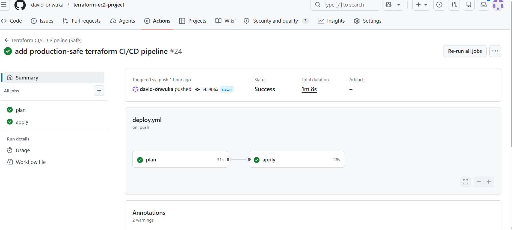
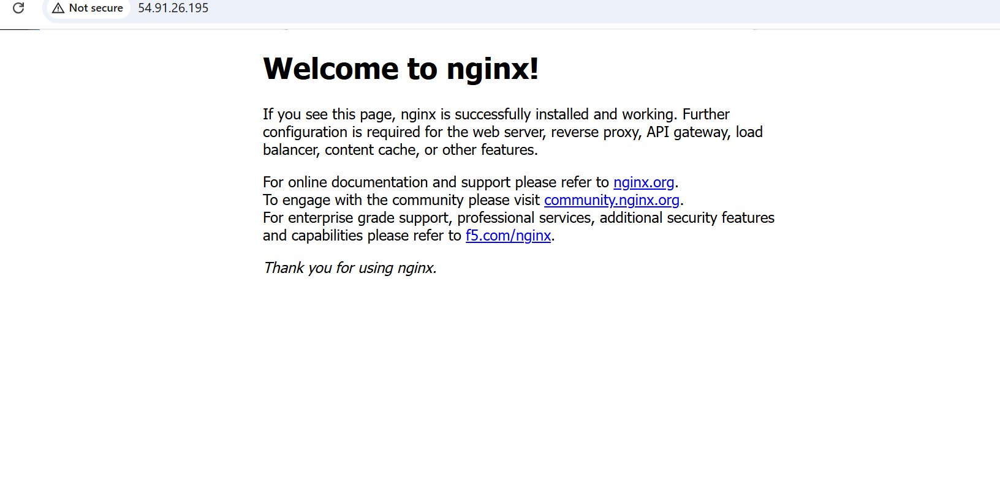

# Infrastructure as Cod (IaC): AWS EC2 Deployment with Terraform, Docker, and Nginx

## Screenshots
 ### CI/CD Pipeline
 

 ### Running Application
 

---

## Project Overview

This project demonstrates Infrastructure as Code (IaC) using Terraform to automate AWS infrastructure provisioning and deploy a Dockerized Nginx web server.

It evolved from a basic EC2 deployment into a production-style DevOps CI/CD workflow with remote state management and automated deployment practices.

---

## Architecture
 GitHub Repository | v GitHub Actions (CI/CD Pipeline) | v Terraform (IaC) | v AWS Cloud ├── EC2 Instance (t2.micro) ├── Security Group (SSH + HTTP) ├── S3 Bucket (Remote State) └── DynamoDB (State Locking) | v Docker | v Nginx Web Server (Port 80)
---
## Tech Stack

- Terraform
- AWS (EC2, S3, DynamoDB)
- Docker
- Nginx
- GitHub Actions
- Linux (Amazon Linux 2)
- Git & GitHub

---

## Features

### Version 1 (Base Infrastructure)
- EC2 provisioning using Terraform
- Security group configuration (SSH + HTTP)
- Docker installation via user data
- Nginx container deployment
- Basic infrastructure automation

---

### Version 2 (CI/CD & Production Upgrade)
- GitHub Actions CI/CD pipeline
- Terraform validate + plan stages
- Controlled deployment workflow
- Remote state storage (S3)
- State locking (DynamoDB)
- Safer infrastructure lifecycle management

---

## CI/CD Workflow

1. Code pushed to GitHub
2. GitHub Actions triggers pipeline
3. Terraform init
4. Terraform fmt & validate
5. Terraform plan
6. Manual approval (optional)
7. Terraform apply

---

## What This Project Does

- Creates AWS EC2 instance
- Configures security groups (HTTP & SSH)
- Installs Docker via user data script
- Runs Nginx container on port 80
- Outputs public IP automatically

---

## Outcome

- Fully automated AWS infrastructure deployment
- Working web server accessible via public IP
- CI/CD pipeline for infrastructure changes
- Remote state management implemented
- Production-style DevOps workflow

---

## Key DevOps Concepts Practiced

- Infrastructure as Code (IaC)
- Cloud automation with Terraform
- CI/CD pipeline design
- Remote backend state management
- Docker-based application deployment
- AWS networking and security groups
- Real-world cloud debugging

---

## Future Improvements

- Add Elastic IP for static address
- Add HTTPS with domain (optional)
- Modular Terraform structure
- VPC + subnet architecture
- Kubernetes deployment version
- Monitoring with CloudWatch

---

## Author

David Onwuka  
Aspiring DevOps Engineer
