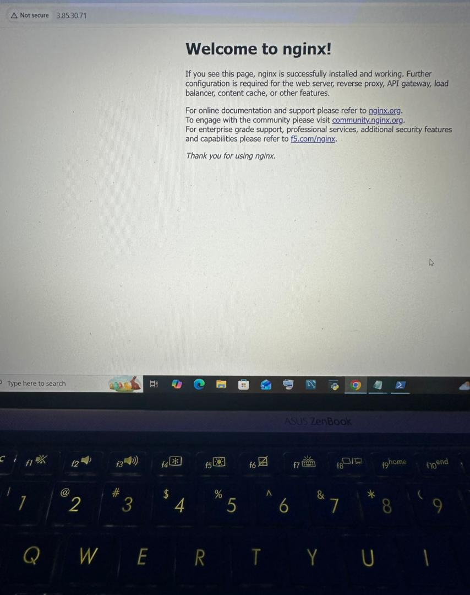

# Terraform AWS EC2 + Docker Nginx Deployment

## Project Architecture
 

## Project Overview

This project demonstrates Infrastructure as Code (IaC) using Terraform to automate the deployment of an AWS EC2 instance running a Dockerized Nginx web server.

The goal is to showcase real-world DevOps practices including cloud provisioning, automation, containerization, and version control using Git and GitHub.

---

## Architecture

- AWS EC2 instance (t2.micro)
- Security Group (SSH + HTTP access)
- Docker installed via EC2 user data script
- Nginx container running on port 80
- Terraform used for full infrastructure automation

---

## Tools & Technologies

- Terraform
- AWS (EC2, Security Groups)
- Docker
- Nginx
- Git & GitHub
- Linux (Amazon Linux 2)

---

## Project Structure
terraform-ec2-project/ ├── main.tf ├── .gitignore 
├── .terraform.lock.hcl └── README.md

## What This Project Does

When you run Terraform, it automatically:

1. Creates a Security Group with:
   - SSH access (port 22)
   - HTTP access (port 80)

2. Launches an AWS EC2 instance (t2.micro)

3. Installs Docker using a startup script (user data)

4. Runs an Nginx container on port 80

5. Outputs the public IP address of the instance

---

## How to Deploy
### 1. Initialize Terraform
```Bash
terraform init

2. Preview infrastructure changes

terraform plan

3. Deploy infrastructure

terraform apply
Type yes when prompted.
```

## Access the Application
Open in browser:

http://3.85.30.71

Note: The public IP changes when the instance is recreated unless you have an Elastic IP.


## Key DevOps Concepts Practiced

Infrastructure as Code (IaC)

Cloud automation using Terraform

AWS EC2 provisioning

Containerization using Docker

Networking with Security Groups

Version control with Git & GitHub

Automated server bootstrapping

## Future Improvements

Add Elastic IP for static public address

Modularize Terraform code

Add VPC and subnet architecture

Use variables.tf for better reusability

Implement CI/CD pipeline using GitHub Actions

Deploy same app using Kubernetes

## Author
David Onwuka

Aspiring DevOps Engineer

